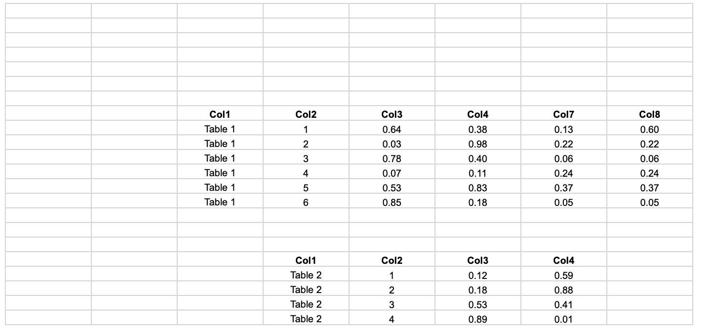
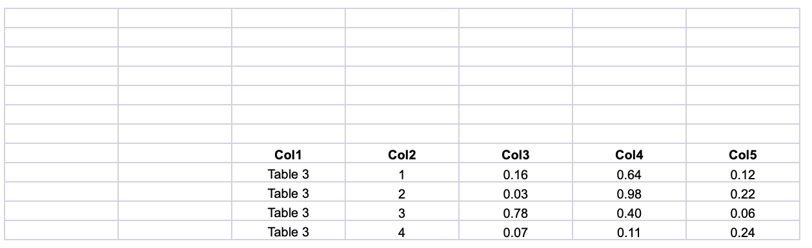
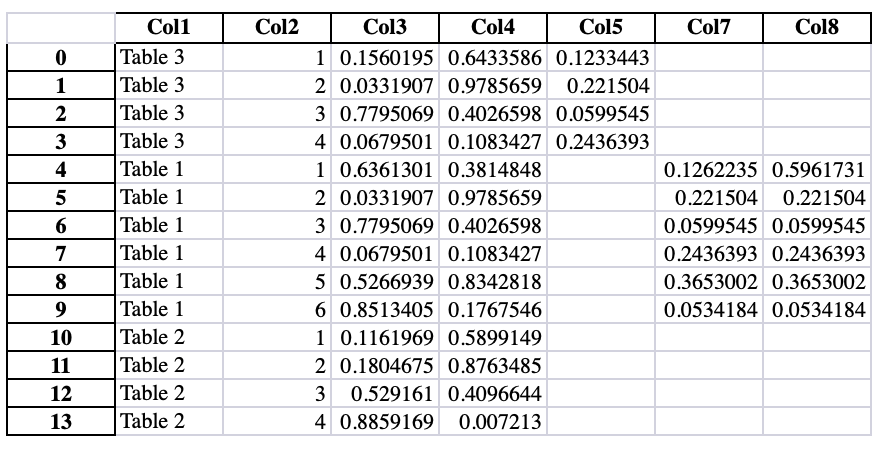

# Extractable
Extract tables from multiple excel files and concatenate them into a single table.

## Usage

```python
extractable = Extractable(
    data_directory="data/",
    result_filename="result.xlsx",
    subtable_header_id="SomeColumnName",
)
extractable.call()
```

## Example
Running the [example.py](example.py) script will result in the table shown below.

| |  |
| - | - |
| **File 1** |  |
| **File 2** |  |
| **Result** |  |
## License
The script is available as open source under the terms of the [MIT License](https://opensource.org/licenses/MIT).
